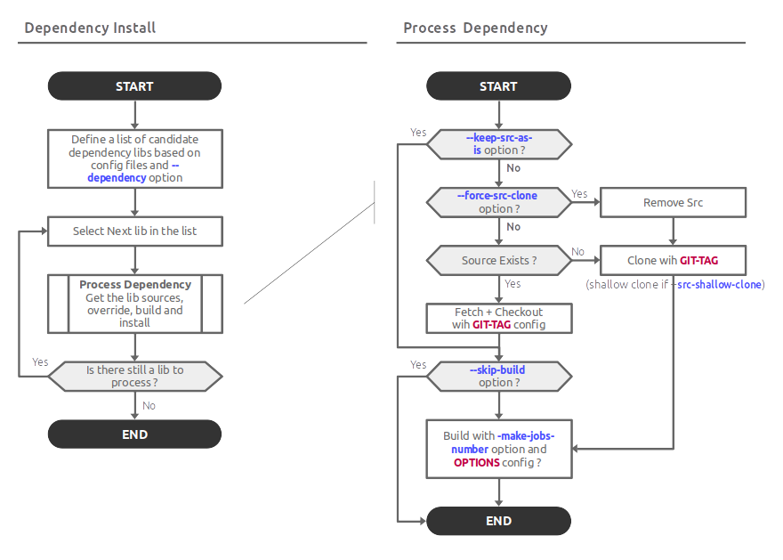

# Dependency install

## Usage

To know the options

```bash
./dep_install.sh --help
```

For a full init

```bash
./dep_install.sh
```

**Tip;** For better performances use `-sc` or `--src-shallow-clone` for shallow clone without the history

```bash
./dep_install.sh -sv
```

## Flow chart


